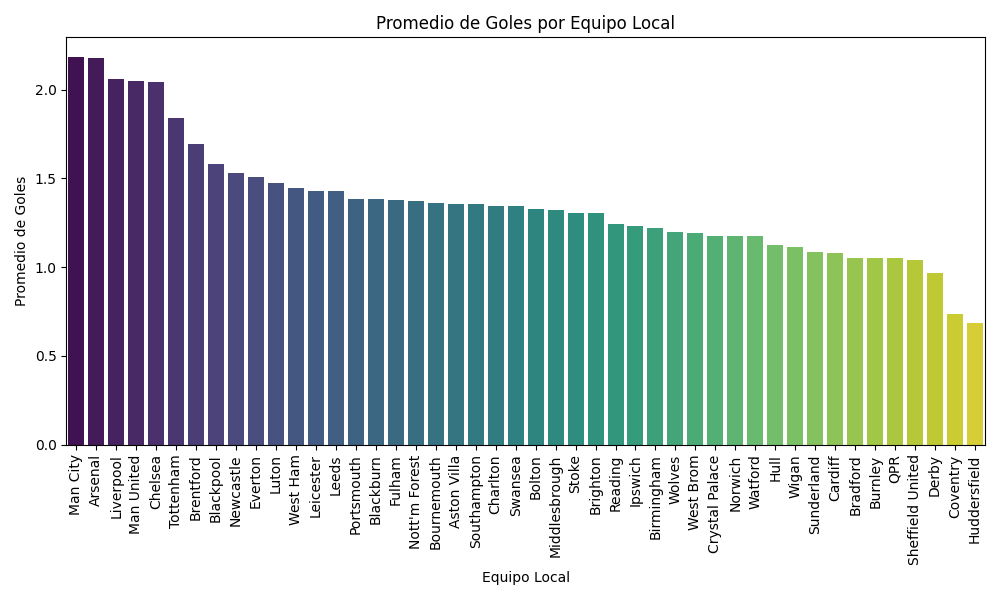

# ETLPremier

## Descripción del proyecto
ETLPremier es un pipeline ETL (Extract, Transform, Load) para procesar datos de la Premier League inglesa. El proyecto extrae datos de partidos, limpia y transforma la información, elimina equipos específicos, carga los resultados en una base de datos SQLite y genera gráficas para el análisis deportivo.

## Diagrama simple del flujo ETL


## Dependencias
- Python 3.x
- pandas
- numpy
- matplotlib
- seaborn
- requests

Instala las dependencias con:
```bash
pip install -r requirements.txt
```

## Pasos de ejecución
1. Configura las rutas de entrada/salida en `Config/config.py`.
2. Ejecuta el pipeline principal:
   ```bash
   python main.py
   ```
3. Revisa el archivo limpio en `Extract/Files/output_clean.csv` y la base de datos `ETLpremier.db`.
4. Las gráficas se mostrarán al final de la ejecución.

## Evidencias de ejecución

### Ejecución ETL
- El script imprime el dataset original, el conteo de nulos y ceros, el dataset limpio y confirma la carga en SQLite.
- Ejemplo de salida:
  ```
  --- DATASET ORIGINAL ---
  <DataFrame con partidos>
  --- NULOS Y CEROS POR COLUMNA ---
  <Conteo por columna>
  --- DATASET LIMPIO ---
  <DataFrame limpio sin equipos eliminados>
  --- NULOS Y CEROS EN DATASET LIMPIO ---
  <Conteo por columna>
  --- CARGANDO DATOS A SQLITE ---
  <Confirmación de carga>
  ```

### Gráficas generadas

#### 1. Promedio de goles de Liverpool

**Interpretación:** Liverpool mantiene un promedio de goles alto en la temporada, lo que refleja su capacidad ofensiva constante.

#### 2. Promedio de tarjetas por equipo

**Interpretación:** Algunos equipos presentan mayor cantidad de tarjetas, indicando estilos de juego más agresivos o defensivos.

#### 3. Promedio de goles por equipo

**Interpretación:** El promedio de goles por equipo permite identificar los clubes más efectivos en ataque y los que necesitan mejorar su ofensiva.

---

**Nota:** Las imágenes de las gráficas deben guardarse en la carpeta `docs/` y pueden generarse automáticamente al ejecutar el pipeline si se habilita el guardado en el código de visualización.

---

## Rama `Release`

### Propósito
Esta rama está destinada a la versión estable y final del pipeline ETL, lista para despliegue o entrega. Aquí se consolidan los cambios probados y documentados, asegurando la reproducibilidad y calidad del proceso.

### Cambios principales y decisiones técnicas
- Corrección y robustez en la limpieza de datos, incluyendo la eliminación de equipos específicos.
- Integración completa del flujo ETL: extracción, transformación, carga y visualización.
- Documentación ampliada y evidencias de ejecución.
- Uso de SQLite para persistencia y CSV para interoperabilidad.
- Decisión de separar cada etapa en módulos independientes para facilitar mantenimiento y escalabilidad.

### Cómo ejecutar esta parte del ETL
1. Instala las dependencias:
   ```bash
   pip install -r requirements.txt
   ```
2. Configura las rutas en `Config/config.py` si es necesario.
3. Ejecuta el pipeline principal desde la raíz del proyecto:
   ```bash
   python main.py
   ```
4. Revisa los resultados en `Extract/Files/output_clean.csv`, la base de datos `ETLpremier.db` y las gráficas generadas.

---